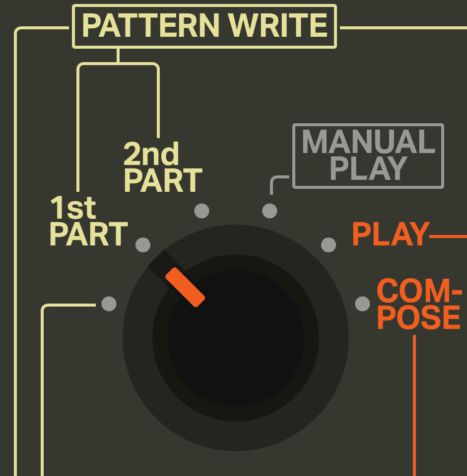
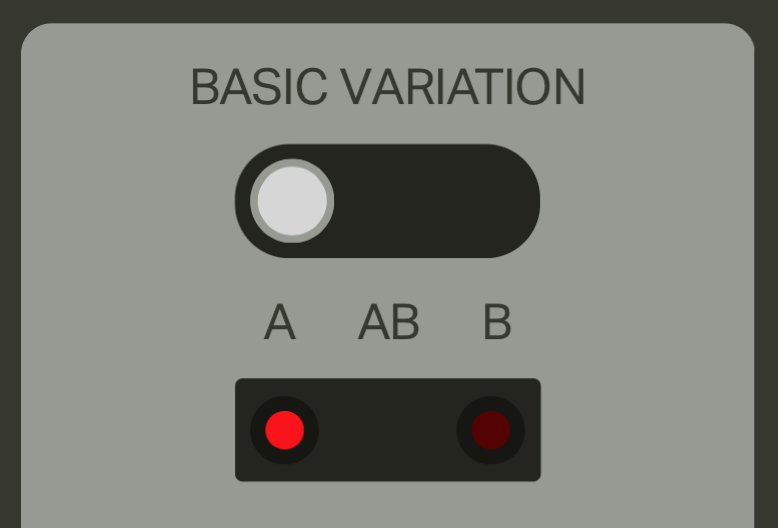
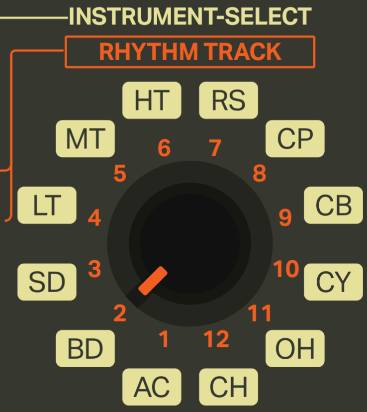
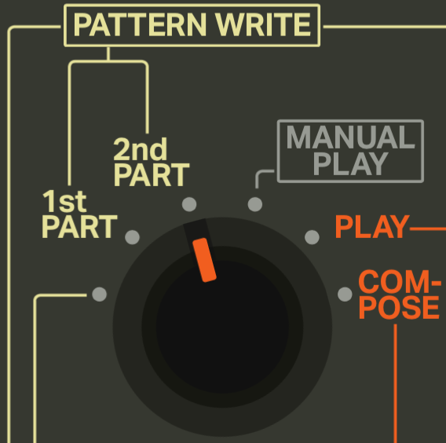
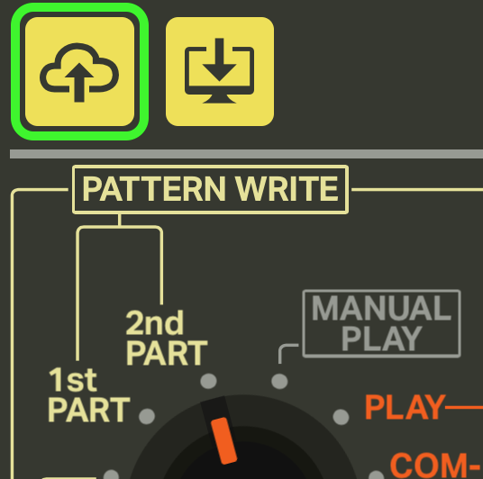
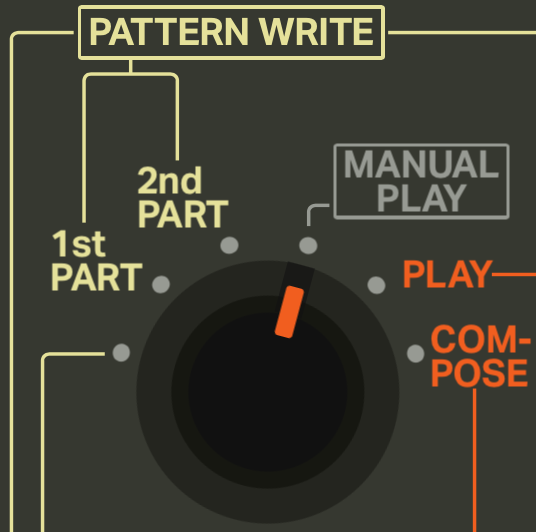

# iO-808 Tutorial

Welcome to the iO-808 tutorial! The primary goal of this webapp is to faithful recreate the functionality of the original TR-808 hardware. Unfortunately if you are unfamiliar with the original hardware, the interface can be difficult to understand. This tutorial should get you quickly up to speed and making your own beats!

#### Table of Contents

[[toc]]

## Programming Patterns

In the 808 there are a total of 12 basic rhythm and 4 fill in patterns that you can store in memory. These patterns are identified by the labels below the step buttons shown here:

Each of these patterns has a first and second part along with an A and B variation which we will talk about next.

### First Part

Lets start programming some patterns.

As a first step we need to turn the `MODE` knob (found at the top-left of the app) to `1st PART` position.

You will also want to ensure the basic variation switch is in the `A` position. We will be talking about programming variations in a following section.

If you look at the step buttons you'll notice that one of the lights will be blinking. While the drum machine is stopped the blinking light will identify which of the 16 patterns we are going to be editing. For now lets select the first pattern.
 

Now when you press the Start/Stop button the lights on the step buttons will be lighting up one by one in sequence. This light represents the current position of the beat. There's no sound coming out though...well that's because we haven't programmed any drum hits into the pattern yet! Lets add some bass drums to our pattern.

First lets make sure we're going to add bass drum hits to our pattern. We determine which drum we're programming using the `INSTRUMENT-SELECT` knob (next to the `MODE` knob in the top-left). So if we want to add bass drum hits to our pattern the `INSTRUMENT-SELECT` knob should be in the `BD` position.

Now just click the step buttons where you want the hits to happen and you should hear the drum hits. The positions where you sequenced in your drum hits also will stay illuminated. If you want to remove a trigger from the sequence just click the step button again and the trigger will be removed.

Each drum sound also has timbral properties that can be adjusted in real time with the following controls:

Now try adding triggers for all the other available drum sounds until you have a fully-composed 16 step pattern!

#### Note: The Accent Instrument

You'll notice that if you add triggers to the `Accent` instrument it doesn't add any drum sound. What this instrument does is allow you to sequence changes to overall volume of all other instruments. The triggers in this sequence correspond to an increase in volume which can add some swing/feel to your patterns. 

The `LEVEL` knob for the `Accent` instrument determines the difference in volume between inactive and active accent steps. The loudest volume will always stay the same but as you increase the Accent's `LEVEL` the inactive steps will increasingly get quieter.

### Second Part

You know what's better than a 16 step pattern? A 32 step pattern!

As mentioned before each pattern has 2 parts that can be programmed. To edit the second part you need to switch to the `2nd PART` mode via the `MODE` knob.

Selecting which pattern you want to edit works the same exact way as the `1st PART`. The first pattern should still be selected so you shouldn't need to do anything other than click play to start editing.
 
When you press play you should notice that the according to the lights on the step buttons, the patterns are empty. You'll also notice that even though they seem empty, the sound coming out is still just looping the `1st PART`. This is by design as when you are in the `2nd PART` mode, you are editing the second part through the step buttons, but you hear the second part in context of being after the `1st PART` (`1st PART` -> `2nd Part` -> Loop back to `1st PART`).

The reason why the sequence is only looping the `1st PART` is due to the fact that the `2nd PART`'s pattern length defaults to zero, which is a great transition to...
 
### Setting Pattern Lengths

By default, the `1st PART` of all 16 patterns has a pattern length of 16 and the `2nd PART` has a pattern length of 0. To set the pattern length of a part you need to have the desired part selected via the `MODE` knob as well as the desired pattern selected the same way you did when selecting which pattern to program beats into.
 
Now to choose the desired pattern length you drag the `CLEAR` button (below the `MODE` knob) to the step button which has the step number that corresponds to the desired pattern length.

This operation can be done whether the sequencer is playing or not.

There is an important difference between setting the pattern length of `1st PART` vs. `2nd PART` though. When you set the pattern length of the `1st PART` of a pattern, it will also set the `2nd PART` pattern length to 0. Setting the `2nd PART` pattern length does not affect the `1st PART`.

So... in order for us to program our second part we need to set a pattern length greater than 0. Try setting it to 16 and then you should be able to edit the second part in the exact same way as you did the first.

### Variations

Tutorial Coming Soon...

## Playing Patterns

After you program a collection of patterns the next step is to turn those patterns into a song. If case you haven't already filled up all your patterns and want to follow along you can download [this example save](io808-full-example.json) <!--{target="_blank" download="io808-example.json"}-->.

To load this save into your own app, download the `JSON` file to your desktop and click the load button (the top left-most button) and select the file you downloaded.

With the full save loaded, you need to switch to the `MANUAL PLAY` mode using the `MODE` knob.

### Selecting the Starting Pattern

When you switch to the `MANUAL_PLAY` mode you'll notice that there will be one step button light blinking and one solid. Each of these illuminated lights represents the selected `BASIC RHYTHM` and `INTRO/FILL IN`. To change the selected `BASIC RHYTHM` you click one of the first 12 step buttons and to select the `INTRO/FILL IN` you click one of the 4 last step buttons.

The blinking of the two illuminated step buttons represents what pattern is going to start when the `START/STOP` button is pressed. By default the `BASIC RHYTHM` pattern is scheduled to be the first patter but if you press the `TAP` button it will toggle between the `BASIC RHYTHM` and the `INTRO/FILL IN`.

### Scheduling Patterns

Coming Soon...

### Using Auto Fill-In

Coming Soon...

## Clearing Patterns

Coming Soon...

## Sharing Patterns

Coming Soon...